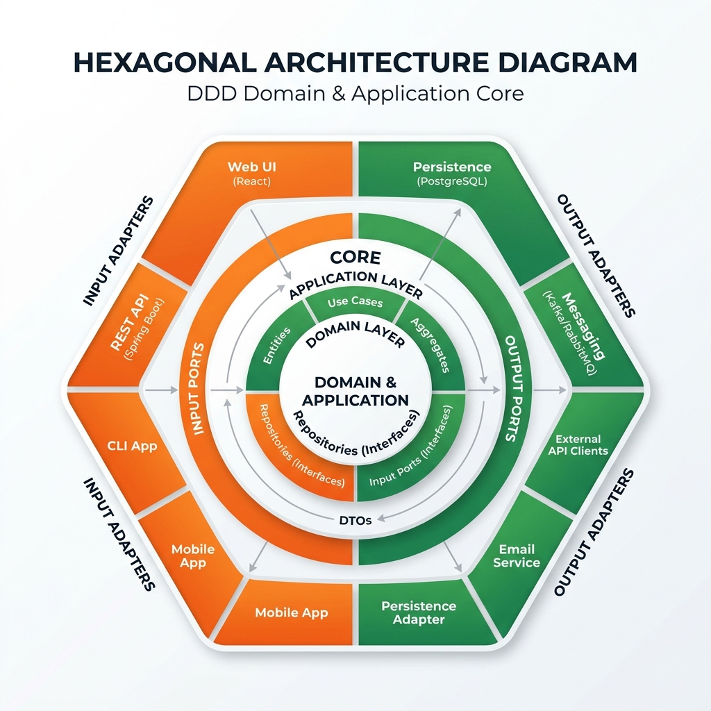
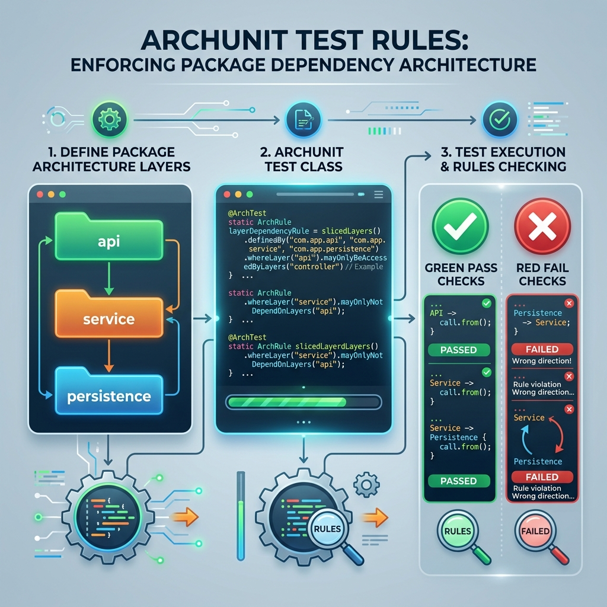

# Satellite Tracking System - DDD & Hexagonal Architecture Demo

This repository is a clean, simple demonstration of **Domain-Driven Design (DDD)** and **Hexagonal Architecture (Ports and Adapters)** in Java 17, with boundaries verified by **ArchUnit** tests.

It simulates a satellite tracking system, highlighting how core business logic is isolated from database technologies (swapping between a standard Java In-Memory database and an Oracle Database).

---

## 📐 Architectural Framework

### 1. Hexagonal & DDD Layer Architecture
The core Hexagon isolates business invariants (Domain Entities, Aggregates, Value Objects, and Application Services) from external infrastructure adapter details (REST APIs, CLI Consoles, and SQL Databases). 



* **Domain Core**: Holds pure business rules (like the `Satellite` aggregate root guarding invariants). Has zero dependencies.
* **Ports**: Boundary interfaces (like `SatelliteRepository` output port).
* **Adapters**: Concrete implementations (like `InMemorySatelliteRepository` or `SatelliteConsoleAdapter`).

---

### 2. ArchUnit Boundary Enforcement
ArchUnit is an assertion library used to automatically verify package dependencies during standard unit test execution.



ArchUnit tests scan the compiled classes and fail the build if any forbidden dependencies occur (e.g. if the Domain layer imports an infrastructure database adapter).

---

## 🚀 Getting Started

### Prerequisites
* Java 17
* Maven 3+

### Run Architecture & Unit Tests
```bash
mvn clean test
```

### Run DB Migration Simulation
```bash
mvn compile exec:java -Dexec.mainClass="com.example.satellite.Main"
```

---

## 🧪 How to Demonstrate an Architecture Violation

To show a live architectural boundary failure during a demo, follow these steps:

1. Open **`Satellite.java`** (`src/main/java/com/example/satellite/domain/Satellite.java`).
2. Add an illegal import to database output persistence adapters:
   ```java
   import com.example.satellite.infrastructure.adapters.output.persistence.OracleSatelliteRepository;
   ```
3. Declare a dummy field reference inside the class:
   ```java
   private OracleSatelliteRepository illegalDbReference;
   ```
4. Run the tests in your terminal:
   ```bash
   mvn test
   ```
5. Observe the test suite fail with a description of the boundary layer violation:
   ```text
   Architecture Violation [Rules: hexagonal_layers_should_be_respected]
   Violation: Layer 'Domain' is not allowed to depend on Layer 'OutputAdapters'
   ```

---

## 📂 Project Structure
```text
src/
├── main/java/com/example/satellite/
│   ├── Main.java (Bootstrap Composer)
│   ├── application/
│   │   ├── RegisterSatelliteCommand.java (DTO)
│   │   └── SatelliteApplicationService.java (Input Port)
│   ├── domain/
│   │   ├── Satellite.java (Aggregate Root)
│   │   ├── Orbit.java (Value Object)
│   │   ├── Telemetry.java (Value Object)
│   │   ├── CollisionRiskService.java (Domain Service)
│   │   └── SatelliteRepository.java (Output Port Interface)
│   └── infrastructure/adapters/
│       ├── input/
│       │   └── SatelliteConsoleAdapter.java (Driving Adapter)
│       └── output/persistence/
│           ├── InMemorySatelliteRepository.java (Driven Adapter)
│           └── OracleSatelliteRepository.java (Driven Adapter)
└── test/java/com/example/satellite/
    ├── architecture/
    │   └── DddArchitectureTest.java (ArchUnit Rules)
    └── domain/
        └── SatelliteDomainTest.java (Domain Unit Tests)
```
